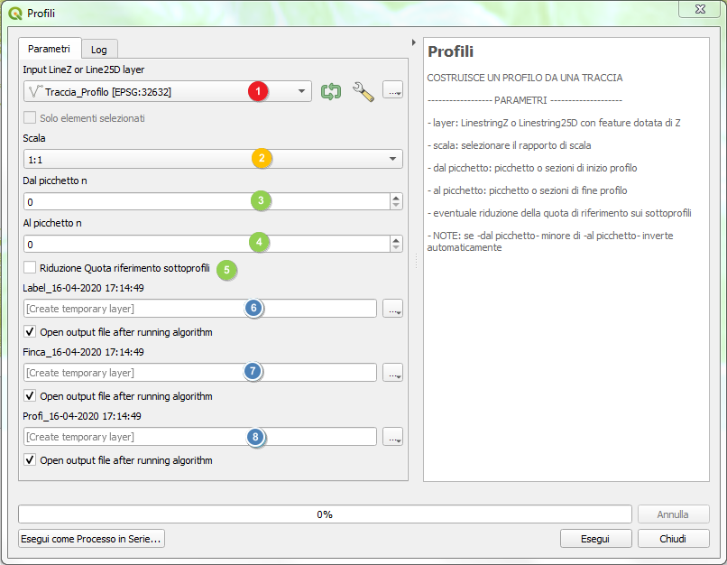

# Profili

## PROCESSING PER REDAZIONE PROFILI

Una tipica attività cartografica consiste nel realizzare profili del terreno, l'algoritmo di processing **_PROFILI_** permette di ottenere rapidamente un profilo da una traccia che sia una LinestringZ o una Linestring25D

## Caricamento algoritmo di processing
	
Da **Strumenti di Processing** eseguire **Aggiungi Script agli Strumenti**

## Finestra dell’algoritmo

Descrizione parametri:

1. [**richiesto**] layer poligonale su cui scegliere la/e particelle da frazionare
2. [**richiesto**]  layer linea su cui disegnare la linea di taglio desiderata
3. [**richiesto** alternativo a 4] Denominatore della frazione di superficie da ottenere (ad esempio 1/3) o in alternativa il numero di parti eguali in cui dividere la particella/poligono
4. [**richiesto** alternativo a 3] In alternativa al numero di parti è possibile specificare l’area che si vuole ottenere come area di risultato. 
L’inserimento di una superficie target fa ignorare il parametro del punto 3
5. [**opzionale**] Di default l’algoritmo produce un layer temporaneo che ha per nome ‘Fraz_’ seguito da data e ora, che dovrete salvare una volta raggiunto il risultato voluto
6. [**opzionale**] Potrebbe essere necessario tagliare la particella con una linea vincolata (ad esempio una strada in progetto con la sua larghezza) in tal caso spuntando la casella verrà eseguito un taglio direttamente con la dividente indicata
7. [**opzionale**] Spuntare se si vogliono n parti della medesima superficie (ovviamente per n maggiore di 2) 
8. [**opzionale**] Poiché la ricerca della posizione della dividente secondo i parametri impostati dipende da come è posizionato il centroide della geometria poligonale, potrebbe ottenersi, nel caso di divisione per frazione (ad esempio 1/3) o nel caso di superficie assegnata, la parte risultante nella posizione non desiderata, spuntando è possibile invertire la posizione rispetto alla dividente.

## Layer necessari
Un layer contenente una o più tracce di cui fare il profilo

## Esecuzione
Dopo aver caricato nei 